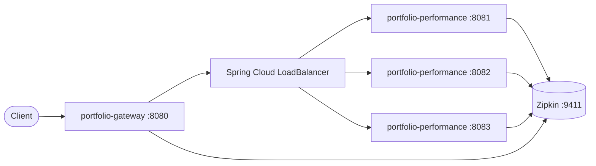

# Portfolio Performance Platform

A multi-module Spring Boot platform that calculates portfolio daily returns behind a production-grade API Gateway with load balancing, structured JSON logging, distributed tracing, and Spring Boot Actuator observability.

**There is no database.** Each request is processed in memory and nothing is stored.

---

## Architecture



### Modules

| Module | Port (default) | Role |
|--------|----------------|------|
| `portfolio-gateway` | 8080 | Single entry point — routes, retries, gateway logging |
| `portfolio-performance` | 8081–8083 | Business API — daily return calculation |
| `portfolio-common` | — | Shared logging utilities (header sanitization, MDC keys, JSON logback) |

### Tech stack

| Component | Version |
|-----------|---------|
| Java | 21 |
| Spring Boot | 3.5.8 |
| Spring Cloud | 2025.0.1 (Northfields) |
| Maven | 3.9+ |

---

## What you need

| Tool | Version |
|------|---------|
| Java | 21 |
| Maven | 3.9 or newer |

---

## Quick start

```bash
# Build and test everything
mvn clean verify

# Start one performance instance (direct access)
mvn -pl portfolio-performance spring-boot:run

# Start the API Gateway (routes to instances on 8081–8083)
mvn -pl portfolio-gateway spring-boot:run
```

### Sample request via Gateway

```bash
curl -s -X POST http://localhost:8080/api/performance/daily-return \
  -H "Content-Type: application/json" \
  -H "traceparent: 00-4bf92f3577b34da6a3ce929d0e0e4736-00f067aa0ba902b7-01" \
  -d '{
    "portfolioId": "PF-1001",
    "valuationDate": "2026-06-14",
    "beginMarketValue": 1000000,
    "endMarketValue": 1035000,
    "netCashFlow": 10000,
    "benchmarkReturnPct": 1.8,
    "currency": "USD",
    "requestedBy": "advisor01"
  }'
```

The same `POST /api/performance/daily-return` path works unchanged — backward compatible with the original single-service API.

---

## API Gateway

All REST traffic enters through `portfolio-gateway` on port **8080**. Routes are defined in `portfolio-gateway/src/main/resources/application.yml` (not hardcoded in Java).

| Route ID | Predicate | Target |
|----------|-----------|--------|
| `portfolio-performance-api` | `Path=/api/performance/**` | `lb://portfolio-performance` |

**Filters:** Retry on `502/503/504` for POST requests (2 retries, exponential backoff).

**Error handling:** JSON error responses from the gateway without exposing internal stack traces.

---

## Load balancing

Spring Cloud LoadBalancer distributes requests across static instances when service discovery is unavailable:

```yaml
spring.cloud.discovery.client.simple.instances.portfolio-performance:
  - http://localhost:8081
  - http://localhost:8082
  - http://localhost:8083
```

Override via environment variables:

| Variable | Default |
|----------|---------|
| `PORTFOLIO_INSTANCE_1_HOST` / `PORTFOLIO_INSTANCE_1_PORT` | localhost / 8081 |
| `PORTFOLIO_INSTANCE_2_HOST` / `PORTFOLIO_INSTANCE_2_PORT` | localhost / 8082 |
| `PORTFOLIO_INSTANCE_3_HOST` / `PORTFOLIO_INSTANCE_3_PORT` | localhost / 8083 |

**Migration path:** Replace `spring.cloud.discovery.client.simple` with Eureka, Consul, or Kubernetes service discovery — the `lb://portfolio-performance` URI stays the same.

### Local multi-instance setup

```bash
# Terminal 1–3: start three performance instances
SERVER_PORT=8081 mvn -pl portfolio-performance spring-boot:run
SERVER_PORT=8082 mvn -pl portfolio-performance spring-boot:run
SERVER_PORT=8083 mvn -pl portfolio-performance spring-boot:run

# Terminal 4: start gateway
mvn -pl portfolio-gateway spring-boot:run
```

---

## Distributed tracing

Micrometer Tracing with Brave propagates W3C `traceparent` headers across:

- Incoming HTTP requests (gateway and service)
- Outgoing gateway → downstream calls
- Async tasks (`@EnableAsync`)

Configure sampling and Zipkin export in `application.yml`:

```yaml
management.tracing.sampling.probability: 1.0   # lower in prod
management.zipkin.tracing.endpoint: http://localhost:9411/api/v2/spans
```

### Trace ID propagation example

```bash
# Client sends traceparent
curl -H "traceparent: 00-4bf92f3577b34da6a3ce929d0e0e4736-00f067aa0ba902b7-01" \
  http://localhost:8080/api/performance/daily-return ...

# Gateway logs include traceId/spanId in JSON
# Downstream service continues the same trace
# Zipkin shows: gateway → portfolio-performance spans
```

---

## Structured JSON logging

All logs are emitted as **one JSON object per line** via Logback + `logstash-logback-encoder` (`portfolio-common/src/main/resources/logback-spring.xml`).

Each log entry includes:

| Field | Source |
|-------|--------|
| `timestamp`, `level`, `message`, `logger`, `thread` | Logback |
| `applicationName`, `serviceName`, `environment` | `application.yml` |
| `hostName`, `processId` | System |
| `traceId`, `spanId` | Micrometer MDC |
| `httpMethod`, `requestUri`, `clientIp`, `userAgent` | Request logging filter |
| `responseStatus`, `executionTimeMs`, `responseSize` | Request completion |
| `exceptionClass`, `exceptionMessage`, `stackTrace` | Errors only |

Sensitive headers (`Authorization`, `Cookie`, `X-Api-Key`, etc.) are redacted as `[REDACTED]`.

### Sample JSON log

```json
{
  "timestamp": "2026-06-29T18:01:53.525045Z",
  "level": "INFO",
  "applicationName": "portfolio-performance",
  "serviceName": "portfolio-performance",
  "environment": "local",
  "hostName": "my-host",
  "processId": "12474",
  "thread": "http-nio-8081-exec-1",
  "logger": "c.p.common.logging.RequestLoggingFilter",
  "message": "Request completed method=POST uri=/api/performance/daily-return status=200 durationMs=42 responseSize=202 traceId=4bf92f3577b34da6a3ce929d0e0e4736 spanId=00f067aa0ba902b7",
  "traceId": "4bf92f3577b34da6a3ce929d0e0e4736",
  "spanId": "00f067aa0ba902b7",
  "httpMethod": "POST",
  "requestUri": "/api/performance/daily-return",
  "responseStatus": "200",
  "executionTimeMs": "42"
}
```

**Request logging:** `RequestLoggingFilter` (servlet) + `RequestLoggingInterceptor` (handler MDC enrichment) on the service; `GatewayRequestLoggingFilter` on the gateway. No duplicate start/complete logs.

---

## Spring Boot Actuator

### Endpoints

| Endpoint | Dev | Prod |
|----------|-----|------|
| `/actuator/health` | ✓ | ✓ |
| `/actuator/health/liveness` | ✓ | ✓ |
| `/actuator/health/readiness` | ✓ | ✓ |
| `/actuator/info` | ✓ | ✓ |
| `/actuator/metrics` | ✓ | ✓ |
| `/actuator/prometheus` | ✓ | ✓ |
| `/actuator/loggers` | ✓ | ✗ |
| `/actuator/env` | ✓ | ✗ |
| `/actuator/configprops` | dev only | ✗ |
| `/actuator/beans` | dev only | ✗ |

Activate profiles: `SPRING_PROFILES_ACTIVE=dev|test|prod`

```bash
curl http://localhost:8081/actuator/health
curl http://localhost:8081/actuator/health/liveness
curl http://localhost:8081/actuator/prometheus
curl http://localhost:8080/actuator/info   # gateway
```

---

## Docker

```bash
mvn clean package -DskipTests
docker compose up --build
```

Services: Zipkin (9411), three performance instances (8081–8083), gateway (8080).

---

## Monitoring integration

| System | Integration |
|--------|-------------|
| **Prometheus** | Scrape `/actuator/prometheus` on each instance |
| **Grafana** | Prometheus datasource + dashboards |
| **Zipkin / Jaeger** | `management.zipkin.tracing.endpoint` |
| **ELK / OpenSearch / Splunk / Loki / Datadog** | Ship JSON stdout logs |

---

## Project structure

```
portfolio-parent/
├── pom.xml                         # Parent BOM (Boot 3.5.8, Cloud 2025.0.1)
├── portfolio-common/               # Shared observability utilities
├── portfolio-performance/          # Business REST API
│   └── src/main/java/com/portfolio/
│       ├── performance/              # Controller, service, validation, calculation
│       └── common/logging/           # Servlet request logging
├── portfolio-gateway/              # Spring Cloud Gateway
├── docker-compose.yml
├── Dockerfile.performance
└── Dockerfile.gateway
```

---

## API reference

### Endpoint

```
POST /api/performance/daily-return
Content-Type: application/json
```

### Request fields

| Field | Type | Required | Description |
|-------|------|----------|-------------|
| `portfolioId` | string | Yes | Portfolio identifier (e.g. `"PF-1001"`) |
| `valuationDate` | date | Yes | Date in `YYYY-MM-DD` format |
| `beginMarketValue` | number | Yes | Market value at start of period |
| `endMarketValue` | number | Yes | Market value at end of period |
| `netCashFlow` | number | Yes | Cash added (positive) or withdrawn (negative) |
| `benchmarkReturnPct` | number | Yes | Benchmark return for the period, in percent |
| `currency` | string | Yes | Currency code (e.g. `"USD"`) |
| `requestedBy` | string | Yes | Who submitted the request |

### Response fields

| Field | Type | Description |
|-------|------|-------------|
| `portfolioId` | string | Echoed from request |
| `valuationDate` | date | Echoed from request |
| `portfolioReturnPct` | number | Calculated return (2 decimal places). `null` when `status` is `INVALID_INPUT` |
| `benchmarkReturnPct` | number | Echoed from request (not recalculated) |
| `excessReturnPct` | number | `portfolioReturnPct - benchmarkReturnPct`. `null` when `status` is `INVALID_INPUT` |
| `status` | string | `VALID`, `REVIEW_REQUIRED`, or `INVALID_INPUT` |
| `reasons` | array of strings | Empty for `VALID`; explains why review or rejection happened |
| `processedAt` | timestamp | UTC time when the response was created (ISO-8601) |

### HTTP status codes

| Situation | HTTP status | Example |
|-----------|-------------|---------|
| Missing field or bad JSON | **400** Bad Request | `portfolioId` omitted |
| Business result (any status in body) | **200** OK | `VALID`, `REVIEW_REQUIRED`, or `INVALID_INPUT` |

---

## Business rules

### Return calculation

**Normal case** (when `beginMarketValue` is not zero):

```
portfolioReturnPct = ((endMarketValue - beginMarketValue - netCashFlow) / beginMarketValue) × 100
excessReturnPct    = portfolioReturnPct - benchmarkReturnPct
```

**Special case:** when both `beginMarketValue` and `endMarketValue` are zero, `portfolioReturnPct` is `0.00`.

### Status values

| Status | When it is returned |
|--------|---------------------|
| `VALID` | Inputs pass validation and no review rules fire |
| `REVIEW_REQUIRED` | Calculation succeeded, but something looks unusual |
| `INVALID_INPUT` | Business validation failed |

### Review thresholds

1. Portfolio return differs from benchmark by **more than 5 percentage points**
2. Net cash flow is **more than 20%** of begin market value

---

## Running tests

```bash
mvn clean verify
```

| Module | Tests |
|--------|-------|
| `portfolio-common` | Header sanitization |
| `portfolio-performance` | 33 tests — calculator, validator, service, controller, actuator, tracing |
| `portfolio-gateway` | Route config, actuator, logging utilities |

---

## Configuration

All settings are externalized in `application.yml` with profile overrides (`application-dev.yml`, `application-test.yml`, `application-prod.yml`).

| Setting | Env variable | Default |
|---------|--------------|---------|
| Gateway port | `GATEWAY_PORT` | 8080 |
| Service port | `SERVER_PORT` | 8081 |
| Environment label | `ENVIRONMENT` | local |
| Tracing sample rate | `TRACING_SAMPLING_PROBABILITY` | 1.0 (dev), 0.1 (prod) |
| Zipkin endpoint | `ZIPKIN_ENDPOINT` | http://localhost:9411/api/v2/spans |
| Service name (LB) | `PORTFOLIO_SERVICE_NAME` | portfolio-performance |

---

## Manual verification checklist

1. `mvn clean verify` — all tests pass
2. Start gateway + one performance instance — `curl` daily-return via `:8080` returns 200
3. Check JSON logs in console — single-line JSON, traceId present
4. `curl /actuator/health` — returns `UP`
5. `curl /actuator/prometheus` — returns Prometheus text format
6. Send `traceparent` header — request succeeds, same trace in logs
7. Start 3 instances — repeated gateway requests hit different backends (check instance logs)

---

## Related files

| File | Purpose |
|------|---------|
| [`prompt-log.md`](prompt-log.md) | Log of AI prompts used during development |
| [`.cursor/skills/calculation-reviewer/SKILL.md`](.cursor/skills/calculation-reviewer/SKILL.md) | Checklist for reviewing calculation logic |
