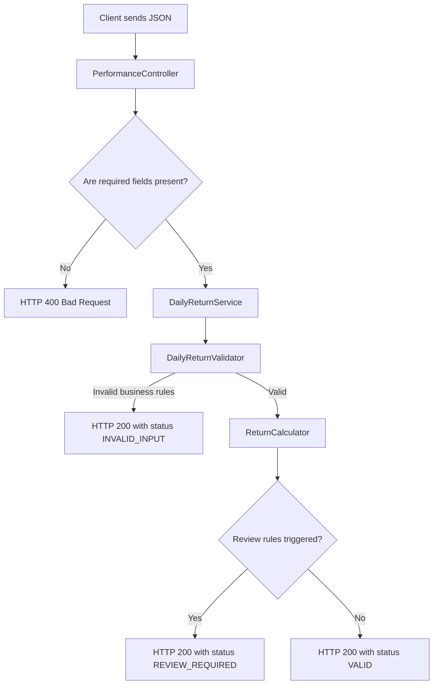

# Portfolio Performance API

A small Spring Boot service that calculates how well a portfolio performed on a given day.

You send market values and cash flow in a JSON request. The API calculates the return, compares it to a benchmark, and tells you whether the result is acceptable, needs review, or has invalid inputs.

**There is no database.** Each request is processed in memory and nothing is stored.

---

## What you need

| Tool | Version |
|------|---------|
| Java | 17 |
| Maven | 3.9 or newer |

**Tech stack (current):**

- Spring Boot **3.3.5**
- Spring Web (REST API)
- Spring Validation (request field checks)
- JUnit 5, Mockito, MockMvc (tests)
- Lombok (optional helper; not required to understand the code)

---

## Quick start

```bash
# 1. Go to the project folder
cd Portfolio_project

# 2. Build and run all tests
mvn clean verify

# 3. Start the server
mvn spring-boot:run
```

The server runs at **http://localhost:8080**.

Try a sample request:

```bash
curl -s -X POST http://localhost:8080/api/performance/daily-return \
  -H "Content-Type: application/json" \
  -d '{
    "portfolioId": "PF-1001",
    "valuationDate": "2026-06-14",
    "beginMarketValue": 1000000,
    "endMarketValue": 1035000,
    "netCashFlow": 10000,
    "benchmarkReturnPct": 1.8,
    "currency": "USD",
    "requestedBy": "advisor01"
  }'
```

---

## How a request flows

When someone calls the API, this is what happens:



In plain terms:

1. The **controller** receives the HTTP request.
2. Spring checks that required fields are present (e.g. `portfolioId` is not blank).
3. The **service** runs business validation, then does the math.
4. The API returns a JSON response with the result and a `status` field.

---

## Project structure

All source code lives under `src/main/java/com/portfolio/performance/`.

```
com.portfolio.performance/
├── PortfolioPerformanceApplication.java   ← starts the app
├── api/                                   ← HTTP layer
│   ├── controller/PerformanceController.java
│   ├── dto/DailyReturnRequest.java
│   ├── dto/DailyReturnResponse.java
│   └── exception/GlobalExceptionHandler.java
├── application/                           ← business logic
│   ├── service/DailyReturnService.java    ← main orchestrator
│   ├── validation/DailyReturnValidator.java
│   ├── validation/ValidationResult.java
│   └── calculation/ReturnCalculator.java
├── domain/
│   ├── CalculationStatus.java             ← VALID, REVIEW_REQUIRED, INVALID_INPUT
│   └── CalculationConstants.java          ← thresholds and rounding rules
└── config/ClockConfig.java                ← makes timestamps testable
```

### Where to start reading (for new developers)

| If you want to understand… | Read this file first |
|----------------------------|----------------------|
| The API endpoint | `api/controller/PerformanceController.java` |
| The full business flow | `application/service/DailyReturnService.java` |
| The return formula | `application/calculation/ReturnCalculator.java` |
| Input validation rules | `application/validation/DailyReturnValidator.java` |
| Request/response shape | `api/dto/DailyReturnRequest.java` and `DailyReturnResponse.java` |
| Error responses (HTTP 400) | `api/exception/GlobalExceptionHandler.java` |

### Tests

Tests mirror the main code under `src/test/java/com/portfolio/performance/`:

| Test class | What it checks |
|------------|----------------|
| `ReturnCalculatorTest` | Math and rounding |
| `DailyReturnValidatorTest` | Business validation rules |
| `DailyReturnServiceTest` | Full flow for all three statuses |
| `PerformanceControllerTest` | HTTP layer with MockMvc |
| `PerformanceControllerIntegrationTest` | End-to-end with real Spring context |

---

## API reference

### Endpoint

```
POST /api/performance/daily-return
Content-Type: application/json
```

### Request fields

| Field | Type | Required | Description |
|-------|------|----------|-------------|
| `portfolioId` | string | Yes | Portfolio identifier (e.g. `"PF-1001"`) |
| `valuationDate` | date | Yes | Date in `YYYY-MM-DD` format |
| `beginMarketValue` | number | Yes | Market value at start of period |
| `endMarketValue` | number | Yes | Market value at end of period |
| `netCashFlow` | number | Yes | Cash added (positive) or withdrawn (negative) |
| `benchmarkReturnPct` | number | Yes | Benchmark return for the period, in percent |
| `currency` | string | Yes | Currency code (e.g. `"USD"`) |
| `requestedBy` | string | Yes | Who submitted the request |

### Response fields

| Field | Type | Description |
|-------|------|-------------|
| `portfolioId` | string | Echoed from request |
| `valuationDate` | date | Echoed from request |
| `portfolioReturnPct` | number | Calculated return (2 decimal places). `null` when `status` is `INVALID_INPUT` |
| `benchmarkReturnPct` | number | Echoed from request (not recalculated) |
| `excessReturnPct` | number | `portfolioReturnPct - benchmarkReturnPct`. `null` when `status` is `INVALID_INPUT` |
| `status` | string | `VALID`, `REVIEW_REQUIRED`, or `INVALID_INPUT` |
| `reasons` | array of strings | Empty for `VALID`; explains why review or rejection happened |
| `processedAt` | timestamp | UTC time when the response was created (ISO-8601) |

### HTTP status codes

| Situation | HTTP status | Example |
|-----------|-------------|---------|
| Missing field or bad JSON | **400** Bad Request | `portfolioId` omitted |
| Business result (any status in body) | **200** OK | `VALID`, `REVIEW_REQUIRED`, or `INVALID_INPUT` |

---

## Business rules

### Return calculation

**Normal case** (when `beginMarketValue` is not zero):

```
portfolioReturnPct = ((endMarketValue - beginMarketValue - netCashFlow) / beginMarketValue) × 100
excessReturnPct    = portfolioReturnPct - benchmarkReturnPct
```

**Special case:** when both `beginMarketValue` and `endMarketValue` are zero, `portfolioReturnPct` is `0.00`.

**Numbers:** all calculations use `BigDecimal` (not `double`) with 2 decimal places and `HALF_UP` rounding. Thresholds live in `CalculationConstants.java`.

**Worked example** (from the assignment):

| Input | Value |
|-------|-------|
| beginMarketValue | 1,000,000 |
| endMarketValue | 1,035,000 |
| netCashFlow | 10,000 |
| benchmarkReturnPct | 1.8 |

| Output | Value |
|--------|-------|
| portfolioReturnPct | 2.50 |
| excessReturnPct | 0.70 |
| status | VALID |

### Status values

| Status | When it is returned |
|--------|---------------------|
| `VALID` | Inputs pass validation and no review rules fire |
| `REVIEW_REQUIRED` | Calculation succeeded, but something looks unusual |
| `INVALID_INPUT` | Business validation failed |

### What causes `INVALID_INPUT`

- `beginMarketValue` is negative
- `endMarketValue` is negative
- `currency` is null or blank
- `beginMarketValue` is 0 and `endMarketValue` is not 0

When status is `INVALID_INPUT`, `portfolioReturnPct` and `excessReturnPct` are `null`, and `reasons` lists what went wrong.

### What causes `REVIEW_REQUIRED`

Either of these (both can apply at once):

1. Portfolio return differs from benchmark by **more than 5 percentage points**  
   `|portfolioReturnPct - benchmarkReturnPct| > 5`

2. Net cash flow is **more than 20%** of begin market value  
   `|netCashFlow| > beginMarketValue × 0.20`

**Edge case:** when `beginMarketValue` is 0, the cash-flow limit is also 0. Any non-zero cash flow triggers review.

---

## Example responses

### VALID

```json
{
  "portfolioId": "PF-1001",
  "valuationDate": "2026-06-14",
  "portfolioReturnPct": 2.50,
  "benchmarkReturnPct": 1.8,
  "excessReturnPct": 0.70,
  "status": "VALID",
  "reasons": [],
  "processedAt": "2026-06-14T10:30:00Z"
}
```

### REVIEW_REQUIRED

Request with a large return vs benchmark (~8% portfolio vs 1.8% benchmark):

```bash
curl -s -X POST http://localhost:8080/api/performance/daily-return \
  -H "Content-Type: application/json" \
  -d '{
    "portfolioId": "PF-1001",
    "valuationDate": "2026-06-14",
    "beginMarketValue": 1000000,
    "endMarketValue": 1080000,
    "netCashFlow": 0,
    "benchmarkReturnPct": 1.8,
    "currency": "USD",
    "requestedBy": "advisor01"
  }'
```

```json
{
  "status": "REVIEW_REQUIRED",
  "reasons": [
    "portfolio return deviates from benchmark by more than 5%"
  ]
}
```

### INVALID_INPUT

```bash
curl -s -X POST http://localhost:8080/api/performance/daily-return \
  -H "Content-Type: application/json" \
  -d '{
    "portfolioId": "PF-1001",
    "valuationDate": "2026-06-14",
    "beginMarketValue": -100,
    "endMarketValue": 1035000,
    "netCashFlow": 10000,
    "benchmarkReturnPct": 1.8,
    "currency": "USD",
    "requestedBy": "advisor01"
  }'
```

```json
{
  "portfolioReturnPct": null,
  "excessReturnPct": null,
  "status": "INVALID_INPUT",
  "reasons": [
    "beginMarketValue must be non-negative"
  ]
}
```

### HTTP 400 (bad request format)

Returned when a required field is missing or JSON is malformed:

```json
{
  "timestamp": "2026-06-14T10:30:00Z",
  "status": 400,
  "error": "Validation failed",
  "message": "One or more request fields are invalid",
  "fieldErrors": [
    {
      "field": "portfolioId",
      "message": "must not be blank"
    }
  ]
}
```

---

## Running tests

```bash
# Run all tests
mvn test

# Build + test (recommended before committing)
mvn clean verify
```

Current test count: **26 tests** across calculator, validator, service, and controller layers.

---

## Design decisions (good to know)

| Topic | Current choice |
|-------|----------------|
| Database | None — stateless API |
| Persistence | No data saved between requests |
| Dependency injection | Constructor injection everywhere |
| Timestamps | `Clock` bean (easy to fix time in tests) |
| Money / percentages | `BigDecimal` only |
| Business vs format errors | Business errors → HTTP 200 with `status` in body; format errors → HTTP 400 |

---

## Configuration

Server settings are in `src/main/resources/application.yml`:

| Setting | Value |
|---------|-------|
| Port | 8080 |
| Application name | portfolio-performance |

---

## Related files

| File | Purpose |
|------|---------|
| [`prompt-log.md`](prompt-log.md) | Log of AI prompts used during development |
| [`.cursor/skills/calculation-reviewer/SKILL.md`](.cursor/skills/calculation-reviewer/SKILL.md) | Checklist for reviewing calculation logic and tests |

---

## Keeping this document up to date

When you change the codebase, update this README if you:

- Add or remove an endpoint
- Change request/response fields
- Change business rules or thresholds (update `CalculationConstants.java` and this file)
- Add a database or new dependency
- Add or rename packages or main classes

The file tree and class names in this document should match `src/main/java` at all times.
# Portfolio_project
